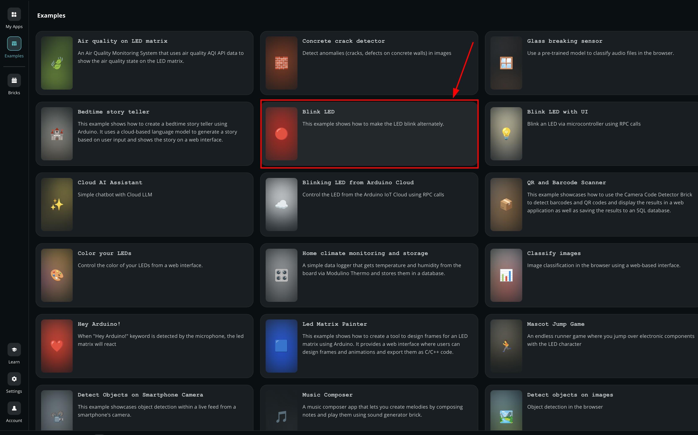

# Arduino App Lab

The [Arduino App Lab](https://docs.arduino.cc/software/app-lab/) is a unified development environment that extends the classic Arduino experience into the world of high-performance computing. Arduino App Lab lets you seamlessly combine Arduino sketches, Python scripts, and containerized Linux applications into a single workflow.

Arduino App Lab comes pre-installed on the UNO Q and can be used in Single-Board Computer (SBC) mode. We highly recommend the 4 GB of RAM UNO Q variant for a better standalone experience.

During the bootcamp we use **PC Hosted Mode**: App Lab runs on your laptop, and the UNO Q is connected over USB-C.

---

## Hello World

Let’s program the UNO Q with the classic Hello World example typical of the Arduino ecosystem: the Blink sketch. We will use this example to verify that the board is correctly connected to the Arduino App Lab.

### Prerequisites:

- Arduino UNO Q
- USB-C cable
- Computer with internet access
- Connect the UNO Q to your PC

#### Step 1: Open the Arduino App Lab, it opens in the Examples section.

#### Step 2: Open the Blink LED example

#### Step 3: Click on the Run button in the top right corner and wait for the app to be uploaded.

You should now see the red LED of the built-in RGB LED turning on for one second, then off for one second, repeatedly.

---

### Running an App at Startup

You can configure a specific App to launch automatically whenever the UNO Q is powered on. This is useful for standalone projects where the board operates without a computer connection.

:::note
You cannot set a built-in Example as the startup app directly from the UI. You must first click Copy and edit app from the example or create a new App from scratch.
:::

- Toggle the Run at startup switch to the ON position.

Once configured, a DEFAULT badge will appear next to your App's name, indicating it will run automatically upon boot.
---

Explore the built-in demos available in the App Lab and experiment with them to get familiar with the environment. Here are a few worth trying:

- **Blink LED with UI**: control an LED through a simple on-screen interface
- **Air Quality on Matrix**: visualise sensor data on the board's LED matrix
- **UNO Q Pin Toggle**: manually toggle digital pins to test your hardware connections

---

## Your Turn

- [ ] Connect your UNO Q to your computer using the USB-C cable.
- [ ] Open Arduino App Lab and confirm your board is detected.
- [ ] Open the **Blink** example and click **Run**: verify the red LED blinks on and off every second.
- [ ] Click **Copy and edit app** on the Blink example to create your own editable copy.
- [ ] Toggle **Run at startup** to ON on your copied App and confirm the DEFAULT badge appears.
- [ ] Try at least **two** of the built-in demos listed above and note what each one does.

:::tip
If the board is not detected, check that you are in **PC Hosted Mode** and the USB-C cable supports data (not charge-only).
:::

