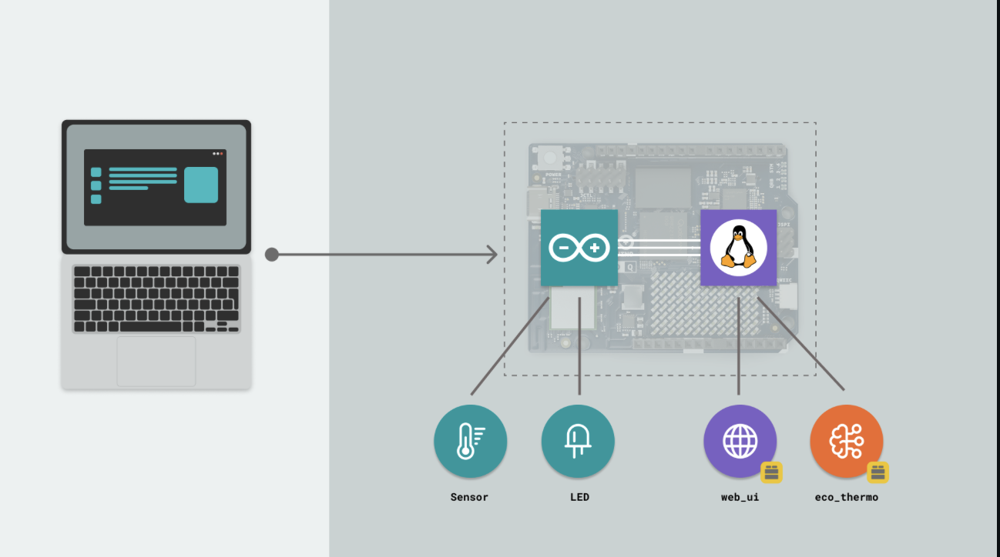
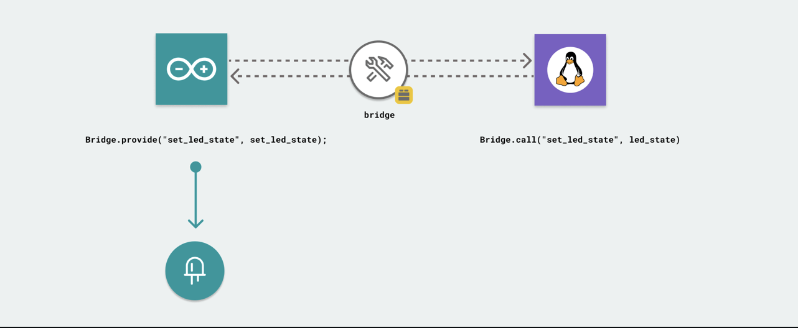

# What is an App?

Apps are launched as a package on our board, and only one App can run at the same time. Apps consist of two major parts:

- **Python** - an application written in Python that runs on the Linux OS.
- **Sketch** - a sketch written in the Arduino language (C++) that runs on the microcontroller.

In particular, the following files are considered the "core" files of an App.

- A `main.py` - for writing code that will run on the Linux side.
- A `sketch.ino` - for writing code that will run on the microcontroller side.
- A `app.yaml` - configuration file for the App (this file automatically updates based on App configurations made, and cannot be edited).

The **Python part** of the application is capable of running AI models, hosting a web server, or making calls to external services.

The **sketch part** of the application handles interaction with sensors, LEDs, motors, and other electrical components.

The two parts can communicate with each other through something called **Bridge**.

---

## Bridge

Bridge is a tool that enables communication between the Linux system and the microcontroller. It allows data to be exchanged between the two systems seamlessly.

This communication works through a **provide and call** mechanism, where one system can provide data and the other can request (or call) that data when needed.

---

## Your Turn

- [ ] Open Arduino App Lab and create a **new App** from scratch.
- [ ] Locate the three core files in your App: `main.py`, `sketch.ino`, and `app.yaml`.
- [ ] In `main.py`, add a `print("Hello from Python!")` statement and run the App: check the output in the terminal.
- [ ] In `sketch.ino`, add a `Serial.println("Hello from Arduino!");` inside `loop()` and verify it appears in the Serial Monitor.
- [ ] Look at the Bridge diagram above and think about: what kind of data would you want to send from the sketch to Python in a real project?