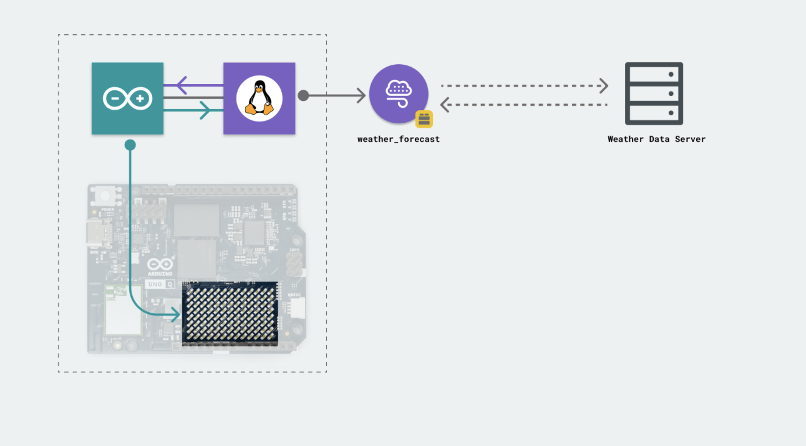
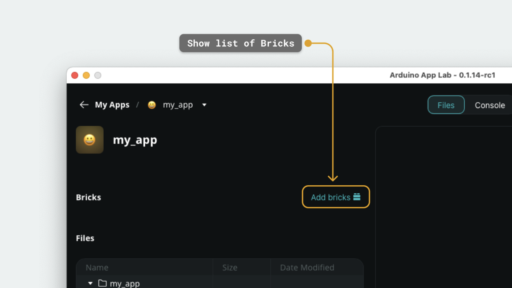
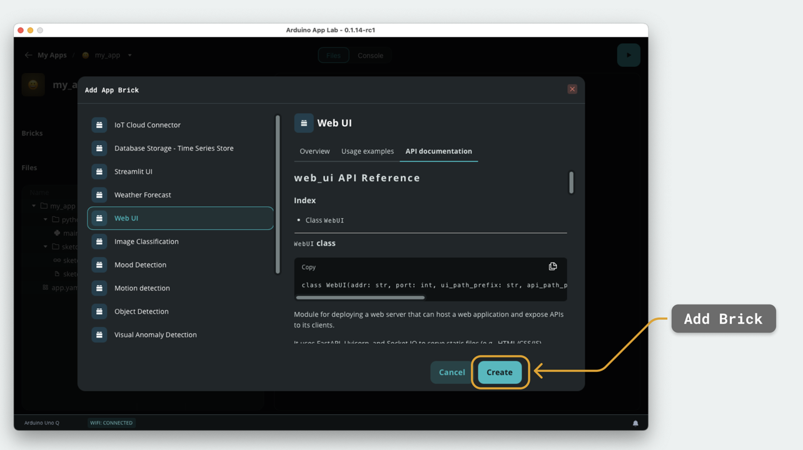

# What is a Brick?

Bricks are **code building blocks** that can be used in our Apps. They are designed to make the App design and coding easier, by making complex code available through only a couple of lines of code.

Bricks vary in functionality: some embed AI models (computer vision, audio recognition), others are used to provide networking & web interfaces. But they are used in the same way: by importing them into the main.py script of our App.

---

## How Bricks are Used in Apps

Bricks are imported into the `main.py` (Python) file that runs on the Linux system. When importing a Brick, we can access its functions, such as making requests to a weather API service, launching a web server, or classifying the video input of a camera.

For example, importing the weather_forecast Brick will make it possible to use:

- `get_forecast_by_city("London")`

Where the API call to the weather forecast platform is already pre-made and ready to be used.

## How to Import a Brick to an App

To import a Brick to an App, we can click on the "Add Brick" button inside an App.

From the list, we can select a Brick, and add it to our App:

---

## Your Turn

- [ ] Open an existing App (or create a new one) in Arduino App Lab.
- [ ] Click the **Add Brick** button inside the App.
- [ ] Browse the list and pick a Brick that interests you: for example, the **weather_forecast** Brick.
- [ ] Add the Brick to your App and open `main.py`.
- [ ] Call one of the Brick's functions, for example: `get_forecast_by_city("London")`, and print the result.
- [ ] Run the App and read the output in the terminal.

:::tip
Try swapping the city name with your own city and see if the Brick returns accurate data.
:::

