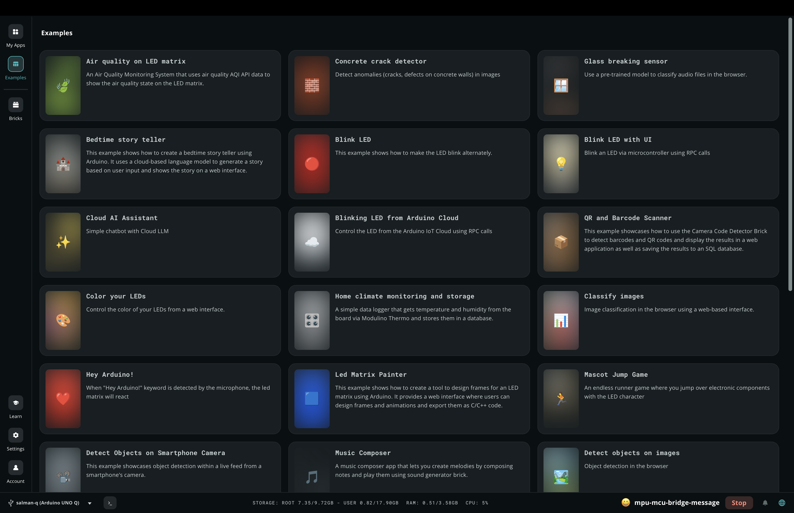

# Example Projects

A collection of example projects available in Arduino App Lab. Use these as a starting point, reference, or inspiration for your own builds.

---

## Examples

- **Blink LED**: turns the built-in LED on and off on a timer. The simplest possible sketch to verify your board is working.

- **Blink LED with UI**: same as Blink, but with a web interface served by the Python side that lets you toggle the LED from a browser.

- **Air Quality on Matrix**: reads data from an air quality sensor and visualises it on the onboard LED matrix in real time.

- **UNO Q Pin Toggle**: a web UI that lets you manually set digital pins HIGH or LOW, useful for testing wiring and connected components.

- **Bridge Echo**: Python sends a string to the Arduino via the Bridge, and the Arduino echoes it back to the shared Monitor console. A good first look at two-way Bridge communication.

- **Camera Stream**: streams live video from a connected USB or CSI camera to a browser-accessible interface hosted on the board.

---

:::tip
Click **Copy and edit app** on any example before modifying it: you cannot edit built-in examples directly.
:::
