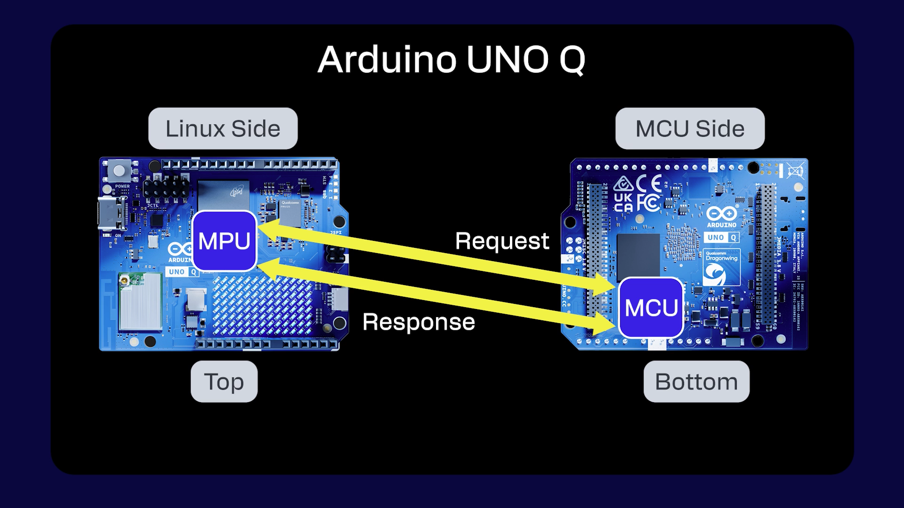

# Hardware Overview

The Arduino UNO Q unlocks a new level of performance for the Arduino ecosystem, blending robust computing power from Qualcomm’s advanced **QRB2210 Microprocessor** (MPU) running a full Debian Linux OS with upstream support, and the real-time responsiveness of a dedicated **STM32U585 Microcontroller** (MCU) running Arduino sketches over **Zephyr OS** — all on a single-board computer.

---

## Board Architecture Overview

- **Microprocessor**: Qualcomm QRB2210 MPU
- **Microcontroller**:TMicroelectronics STM32U585 (32-bit Arm Cortex-M33) MCU
- **Wireless Connectivity**: WCBN3536A radio module, dual-band Wi-Fi 5 (2.4/5 GHz) and Bluetooth® 5.1 connectivity,
- **Memory:** The board features 16 GB or 32 GB options of eMMC storage and 2 GB or 4 GB options of LPDDR4 RAM.
- **Multimedia Codec**: The ANX7625 multimedia codec enables video and audio output through the onboard USB-C connector.
- **Power Management**: The UNO Q includes the Qualcomm® PM4145.

## Pinout

{/*  */}

<embed src="https://docs.arduino.cc/resources/pinouts/ABX00162-full-pinout.pdf" type="application/pdf" width="80%" height="600px" />

## First Use - Powering the Board

The Arduino UNO Q can be powered by:

- A USB-C® cable providing 5 VDC 3 A (not included).
- An external +5 VDC power supply connected to 5V pin.
- An external +7-24 VDC power supply connected to VIN pin.

---

## Power Button

The UNO Q features a power button that can be used to reboot the board.

Long press: the board’s Linux part is rebooted when the button is pressed for 5+ seconds.

:::note
You do not need to press the power button for the board to power up, it boots automatically after being powered.
:::

---

## MPU and MCU Communication

####  Bridge - Remote Procedure Call (RPC) Library

The Arduino UNO Q uses RPC (Remote Procedure Call) to exchange data between the Linux (Qualcomm MPU) side and the real-time STM32 MCU.

The `Bridge` library provides a communication layer built on top of the `Arduino_RPClite` framework. It manages bidirectional RPC traffic between the MPU and MCU, handling method binding, request forwarding, and asynchronous responses.

---

## Wireless Connectivity

The UNO Q features the WCBN3536A radio module that provides dual-band Wi-Fi® 5 (2.4/5 GHz) and Bluetooth® 5.1 to the board.

Since the radio module is connected to the Qualcomm microprocessor, we need the Bridge to expose the connectivity to the microcontroller.