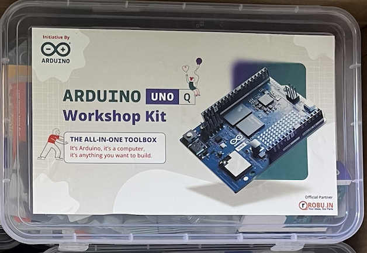

# Bootcamp Hardware Kit

Every participant receives a pre-packed hardware kit on Day 1 of the bootcamp. The kit contains everything you need to complete all hands-on sessions and your final project.

:::note
Bring your own laptop. The kit does not include a computer.
:::

---

## What's in the Box

| # | Component | Qty | Purpose |
|---|---|---|---|
| 1 | **Arduino UNO Q** | 1 | Main board: runs Linux (MPU) + Arduino sketches (MCU) |
| 2 | **USB-C Cable (5V 3A)** | 1 | Power and data connection to your laptop |
| 2 | **USB Power Supply** | 1 | Power the Arduino UNO Q |
| 3 | **USB Hub: Arduino USB-C Hub 8-in-1 (TPX00241)** | 1 | Connectivity hub for camera, peripherals |
| 4 | **Breadboard (Mini)** | 1 | Prototype circuits without soldering |
| 5 | **Jumper Wire Sets (M-M, M-F)** | 1 | Connect components to the board and breadboard |
| 6 | **LEDs (Assorted)** | 1 | Output indicators |
| 7 | **Resistors (Assorted)** | 1 | Current limiting / Pull-up / Pull-down |
| 8 | **Push Buttons** | 1 | Manual input testing |
| 09| **USB Camera** | 1 | Image classification projects|
| 10| **I2C Microphone Module** | 1 | Sound classification projects|
| 11| **IMU Module (Accelerometer + Gyro)** | 1 | Motion and gesture detection|
| 12| **Ultrasonic Sensor (HC-SR04)** | 1 | Distance sensing for robotics|
| 13| **Hudmit and Temperature Sensor** | 1 | Environmental monitoring|
| 14| **Vibration Sensor** | 1 | Anomaly detection|
| 15| **Light Sensor (LDR / Digital)** | 1 | Ambient detection systems|
| 16| **OLED Display Module** | 1 | Visual output display|
| 17| **Resistors (Assorted)** | 1 | Current limiting / Pull-up / Pull-down|

---

